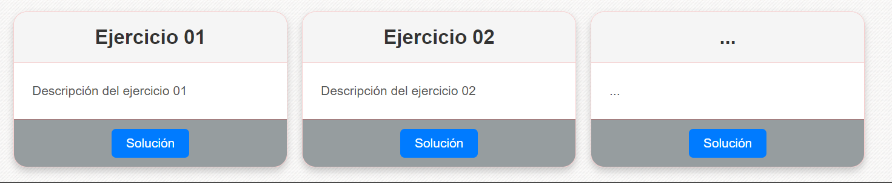

# JS-Portfolio

<H1>Portfolio de javascript</H1>

Al entrar podemos encontrarnos con un navbar con informacion interesante como la web W3 School y mi propio github

 

En este portfolio podremos ver algunos de los ejercicios ordenados por en cards

